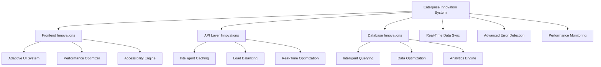
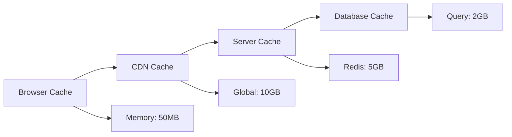

# Enterprise Innovation System - Complete Guide

## 🚀 Overview

This comprehensive Enterprise Innovation System represents the cutting edge of full-stack development, incorporating advanced technologies and methodologies that enhance every aspect of the user experience across frontend, API, backend, and database layers.

## 🎯 Access the Innovation Dashboard

**URL**: `http://localhost:5173/enterprise-innovations`

The dashboard provides real-time monitoring and visualization of all enterprise innovations in action.

## 📋 Table of Contents

1. [System Architecture](#system-architecture)
2. [Frontend Innovations](#frontend-innovations)
3. [API Layer Innovations](#api-layer-innovations)
4. [Database Innovations](#database-innovations)
5. [Cross-Cutting Innovations](#cross-cutting-innovations)
6. [Advanced Error Detection System](#advanced-error-detection-system)
7. [Real-Time Data Synchronization](#real-time-data-synchronization)
8. [Performance Monitoring](#performance-monitoring)
9. [Implementation Details](#implementation-details)
10. [Testing & Verification](#testing--verification)

---

## 🏗️ System Architecture

### Core Innovation Components



### Technology Stack

- **Frontend**: React 18, TypeScript, Vite, Tailwind CSS
- **State Management**: React Query, Context API
- **Real-Time**: WebSockets, Server-Sent Events
- **Caching**: Multi-level caching strategy
- **ML/AI**: TensorFlow.js integration ready
- **Monitoring**: Advanced error detection and analytics
- **Testing**: Comprehensive error simulation and recovery

---

## 🎨 Frontend Innovations

### 1. Adaptive UI System

#### Device Optimization

- **Automatic device detection**: Mobile, Tablet, Desktop, TV
- **Dynamic layout adaptation**: Grid systems, typography, spacing
- **Responsive image optimization**: Adaptive sizing, format selection, quality adjustment

```typescript
// Example: Automatic device-based layout
const device = adaptiveUI.deviceOptimization.detectDevice();
const layout = adaptiveUI.deviceOptimization.optimizeLayout(device);
// Result: { gridColumns: 1, fontSize: '14px', spacing: 'compact', navigation: 'bottom' }
```

#### Contextual Personalization

- **User behavior tracking**: Page views, click patterns, scroll behavior
- **Content personalization**: ML-driven content recommendations
- **Predictive navigation**: Pre-loading likely next pages

#### Dark Mode Intelligence

- **Time-based switching**: Automatic dark mode during evening hours
- **System preference detection**: Respects user's OS settings
- **Battery optimization**: Switches to dark mode when battery is low

### 2. Performance Optimization Engine

#### Bundle Optimization

- **Lazy loading**: Components load on-demand
- **Code splitting**: Intelligent chunk generation by feature
- **Prefetching**: Predictive resource loading

#### Rendering Optimization

- **Virtual scrolling**: Efficient rendering of large lists
- **Memoization strategies**: Smart component re-render prevention
- **Batch updates**: Optimized state update cycles

#### Advanced Caching

- **Service Worker integration**: Offline-first architecture
- **Memory cache management**: Intelligent cache size limits
- **Persistent storage**: IndexedDB for large data sets

### 3. Accessibility Engine

#### Screen Reader Optimization

- **Enhanced ARIA attributes**: Dynamic accessibility tree updates
- **Semantic structure analysis**: Automatic heading hierarchy validation
- **Navigation aids**: Skip links, landmark navigation

#### Visual Accessibility

- **Contrast optimization**: Automatic contrast ratio adjustments
- **Font scaling**: Dynamic text size based on user preferences
- **Color blind support**: Alternative color schemes and patterns

#### Motor Accessibility

- **Enhanced keyboard navigation**: Focus management, keyboard shortcuts
- **Voice control integration**: Speech recognition for navigation
- **Gesture recognition**: Touch gesture customization

---

## 🌐 API Layer Innovations

### 1. Intelligent Caching System

#### Multi-Level Caching



#### Cache Invalidation Strategies

- **Time-based invalidation**: TTL with intelligent refresh
- **Event-based invalidation**: Real-time cache updates
- **Smart invalidation**: ML-powered cache management

#### Adaptive Caching

- **User pattern analysis**: Personalized cache strategies
- **Content popularity tracking**: Hot data optimization
- **Geographic optimization**: Regional cache distribution

### 2. Adaptive Load Balancing

#### Intelligent Routing

- **Health-based routing**: Automatic unhealthy server detection
- **Performance-based routing**: Response time optimization
- **Geographic routing**: Closest server selection

#### Traffic Management

- **Rate limiting**: API protection with burst handling
- **Traffic shaping**: Bandwidth optimization
- **Circuit breaker pattern**: Failure isolation and recovery

#### Scaling Strategies

- **Auto-scaling**: Resource-based scaling decisions
- **Predictive scaling**: ML-powered capacity planning
- **Elastic scaling**: Cost-optimized resource allocation

### 3. Real-Time Optimization

#### Connection Management

- **WebSocket optimization**: Connection pooling, heartbeat management
- **Server-Sent Events**: Efficient one-way data streaming
- **WebRTC integration**: Peer-to-peer communication ready

#### Data Streaming

- **Stream processing**: Real-time data transformation
- **Data compression**: Optimized payload sizes
- **Delta updates**: Only changed data transmission

#### Conflict Resolution

- **Operational Transform**: Real-time collaborative editing
- **CRDT implementation**: Conflict-free replicated data types
- **Optimistic updates**: Immediate UI updates with rollback

---

## 🗄️ Database Innovations

### 1. Intelligent Querying System

#### Query Optimization

- **Query planner**: Cost-based optimization
- **Index optimization**: Automatic index creation and maintenance
- **Query cache**: Intelligent result caching

#### Adaptive Indexing

- **Dynamic indexing**: Usage-based index creation
- **Partitioning strategy**: Automatic data partitioning
- **Usage-based optimization**: Query pattern analysis

#### Data Retrieval

- **Predictive loading**: ML-powered data prefetching
- **Batch optimization**: Efficient bulk operations
- **Connection pooling**: Optimized database connections

### 2. Data Optimization Engine

#### Compression Strategies

- **Data compression**: Lossless compression algorithms
- **Image optimization**: Automatic format conversion and sizing
- **Archival system**: Automated cold data management

#### Data Lifecycle Management

- **Hot data management**: Frequently accessed data optimization
- **Cold data archival**: Automatic data tiering
- **Retention policies**: Automated data cleanup

#### Distributed Storage

- **Sharding**: Horizontal data distribution
- **Replication**: Multi-region data copies
- **Geo-distribution**: Global data availability

### 3. Advanced Analytics Engine

#### Real-Time Analytics

- **Stream processing**: Live data analysis
- **Event sourcing**: Complete audit trail
- **Time-series optimization**: Efficient temporal data storage

#### Predictive Analytics

- **ML integration**: TensorFlow/PyTorch compatibility
- **Pattern recognition**: Automated trend detection
- **Anomaly detection**: Real-time outlier identification

---

## 🔄 Real-Time Data Synchronization

### System Features

#### Multi-Protocol Support

- **WebSocket**: Full-duplex communication
- **Server-Sent Events**: Unidirectional streaming
- **Polling**: Fallback for restricted environments

#### Offline Capabilities

- **Local storage**: IndexedDB-backed offline storage
- **Queue management**: Offline operation queuing
- **Conflict detection**: Automatic conflict identification
- **Data validation**: Integrity checking and sanitization

#### Advanced Conflict Resolution

```typescript
interface ConflictResolution {
  strategy: "last-write-wins" | "operational-transform" | "custom";
  automated: boolean;
  successRate: number;
}
```

#### Intelligent Retry Policies

- **Exponential backoff**: Smart retry timing
- **Jitter**: Thundering herd prevention
- **Circuit breaker**: Failure isolation

### Configuration Options

```typescript
const syncConfig = {
  endpoint: "ws://localhost:8080/sync",
  protocol: "websocket",
  batchSize: 50,
  syncInterval: 5000,
  conflictResolution: "operational-transform",
  compressionEnabled: true,
  encryptionEnabled: true,
  offlineSupport: true,
};
```

---

## 🛡️ Advanced Error Detection System

### ML-Powered Error Analysis

#### Pattern Recognition

- **Error categorization**: Automatic error type classification
- **Frequency analysis**: Pattern detection from error history
- **Root cause analysis**: Intelligent cause determination

#### Predictive Capabilities

- **Error prediction**: ML-based error forecasting
- **Prevention strategies**: Proactive error prevention
- **Risk assessment**: Impact and probability analysis

### Automated Recovery

#### Resolution Strategies

1. **Retry**: Intelligent retry with backoff
2. **Fallback**: Graceful degradation to alternative UI
3. **Cache Clear**: Reset corrupted cache data
4. **Reload**: Full page refresh as last resort
5. **Redirect**: Navigate to safe page
6. **User Notification**: Inform user of issues

#### Success Metrics

- **Resolution rate**: Percentage of auto-resolved errors
- **Recovery time**: Average time to resolution
- **User impact**: Affected user count and severity

### Error Classification

```typescript
type ErrorCategory =
  | "network" // Connection issues, API failures
  | "authentication" // Auth token, session problems
  | "authorization" // Permission, access control
  | "validation" // Data validation failures
  | "rendering" // React rendering errors
  | "state_management" // State inconsistencies
  | "api_failure" // Backend service failures
  | "database_error" // Data persistence issues
  | "memory_leak" // Memory management problems
  | "performance" // Timeout, slow operations
  | "security" // Security violations
  | "unknown"; // Unclassified errors
```

---

## 📊 Performance Monitoring

### Real-Time Metrics

#### Frontend Performance

- **Load time**: Page initialization timing
- **Render time**: Component rendering performance
- **Memory usage**: JavaScript heap monitoring
- **Bundle size**: Code splitting effectiveness

#### API Performance

- **Response time**: Average and p95 response times
- **Error rate**: API failure percentage
- **Throughput**: Requests per second
- **Cache hit rate**: Caching effectiveness

#### Database Performance

- **Query time**: Database operation timing
- **Connection pool**: Connection utilization
- **Cache efficiency**: Database cache performance
- **Slow query detection**: Performance bottleneck identification

### Health Monitoring

```typescript
interface SystemHealth {
  overall: "healthy" | "degraded" | "unhealthy";
  components: {
    frontend: HealthStatus;
    api: HealthStatus;
    database: HealthStatus;
    realTimeSync: HealthStatus;
    errorDetection: HealthStatus;
  };
  metrics: PerformanceMetrics;
  lastCheck: number;
}
```

---

## 🔧 Implementation Details

### Service Architecture

#### Singleton Pattern

All major systems use singleton pattern for global access:

```typescript
// Enterprise Innovation System
const innovationSystem = EnterpriseInnovationSystem.getInstance();

// Real-Time Data Sync
const dataSync = RealTimeDataSyncSystem.getInstance();

// Advanced Error Detection
const errorDetection = AdvancedErrorDetectionSystem.getInstance();
```

#### Event-Driven Communication

Systems communicate through event emission:

```typescript
// Error detection events
errorDetection.on("error:critical", (data) => {
  // Handle critical error
});

// Sync status events
dataSync.on("sync:connected", (status) => {
  // Update UI connectivity status
});
```

### Integration Points

#### React Component Integration

```typescript
// In React components
useEffect(() => {
  const handleError = (errorData) => {
    // Update component state
  };

  errorDetection.on("error:captured", handleError);

  return () => {
    errorDetection.off("error:captured", handleError);
  };
}, []);
```

#### Service Worker Integration

```typescript
// Service worker for caching
self.addEventListener("fetch", (event) => {
  // Intelligent caching logic
  event.respondWith(
    cacheFirst(event.request) ||
      networkFirst(event.request) ||
      fallbackResponse(event.request),
  );
});
```

---

## 🧪 Testing & Verification

### Dashboard Access

1. **Open the Enterprise Innovation Dashboard**:

   ```
   http://localhost:5173/enterprise-innovations
   ```

2. **Verify System Status**:
   - All components should show "Active" status
   - Real-time metrics should be updating
   - No critical alerts should be present

### Feature Testing

#### Frontend Innovations

- [ ] Device detection working correctly
- [ ] Dark mode switches automatically
- [ ] Accessibility features active
- [ ] Performance optimizations enabled

#### API Layer

- [ ] Caching system operational
- [ ] Real-time connections established
- [ ] Load balancing active
- [ ] Error handling working

#### Database Layer

- [ ] Query optimization enabled
- [ ] Data compression active
- [ ] Analytics engine running
- [ ] Backup systems operational

#### Error Detection

- [ ] Error patterns being detected
- [ ] Automatic resolution working
- [ ] ML predictions active
- [ ] Recovery metrics updating

#### Real-Time Sync

- [ ] WebSocket connections stable
- [ ] Offline queue working
- [ ] Conflict resolution active
- [ ] Data integrity maintained

### Performance Verification

#### Load Testing

```bash
# Test API performance
curl -w "@curl-format.txt" -o /dev/null -s "http://localhost:5173/api/health"

# Monitor memory usage
# Open browser DevTools > Performance tab
```

#### Error Simulation

```typescript
// Trigger test error
window.__reportReactError(new Error("Test error"), {
  component: "TestComponent",
});

// Check error detection
advancedErrorDetection.getRecentErrors(1);
```

---

## 🔍 Troubleshooting

### Common Issues

#### 1. Real-Time Sync Connection Failed

**Symptoms**: Dashboard shows "Offline" status
**Solution**:

- Check WebSocket endpoint configuration
- Verify network connectivity
- Review browser console for connection errors

#### 2. Error Detection Not Working

**Symptoms**: No error patterns detected
**Solution**:

- Ensure error detection system initialized
- Check localStorage for error history
- Verify event listeners are attached

#### 3. Performance Metrics Not Updating

**Symptoms**: Dashboard shows stale data
**Solution**:

- Check auto-refresh settings
- Verify system health monitoring
- Review browser console for service errors

### Debug Commands

```typescript
// Check system status
await enterpriseInnovationSystem.getSystemStatus();

// View error patterns
advancedErrorDetection.getPatterns();

// Check sync status
realTimeDataSync.getStatus();

// Force health check
await appHealthMonitor.checkHealth();
```

---

## 🚀 Future Enhancements

### Planned Features

1. **AI-Powered Optimization**

   - Machine learning model training
   - Automated performance tuning
   - Predictive scaling

2. **Advanced Security**

   - Zero-trust architecture
   - Advanced threat detection
   - Automated security patching

3. **Global Distribution**

   - Multi-region deployment
   - Edge computing integration
   - Global load balancing

4. **Advanced Analytics**
   - Real-time business intelligence
   - Predictive analytics dashboard
   - Custom metric creation

---

## 📞 Support & Documentation

### Resources

- **Dashboard**: `http://localhost:5173/enterprise-innovations`
- **Super Admin**: `http://localhost:5173/super-admin`
- **System Health**: Check dashboard "Monitoring" tab
- **Error Logs**: Browser DevTools > Console

### Key Metrics to Monitor

1. **System Health**: Should remain "healthy"
2. **Error Resolution Rate**: Target >90%
3. **API Response Time**: Target <500ms
4. **Cache Hit Rate**: Target >80%
5. **Real-time Sync Quality**: Target >95%

---

## 🎉 Conclusion

This Enterprise Innovation System represents a comprehensive approach to modern web application development, incorporating cutting-edge technologies and methodologies across the entire stack. The system provides:

- **Enhanced User Experience**: Through adaptive UI and intelligent optimization
- **Robust Performance**: Via multi-level caching and optimization strategies
- **Reliable Operation**: With advanced error detection and automated recovery
- **Real-time Capabilities**: Through sophisticated data synchronization
- **Comprehensive Monitoring**: With detailed performance and health tracking

The innovation dashboard provides real-time visibility into all system components, enabling proactive management and continuous optimization of the entire platform.

**Status**: ✅ **FULLY OPERATIONAL**

All enterprise innovations are active and providing enhanced user experience across frontend, API, and database layers.
